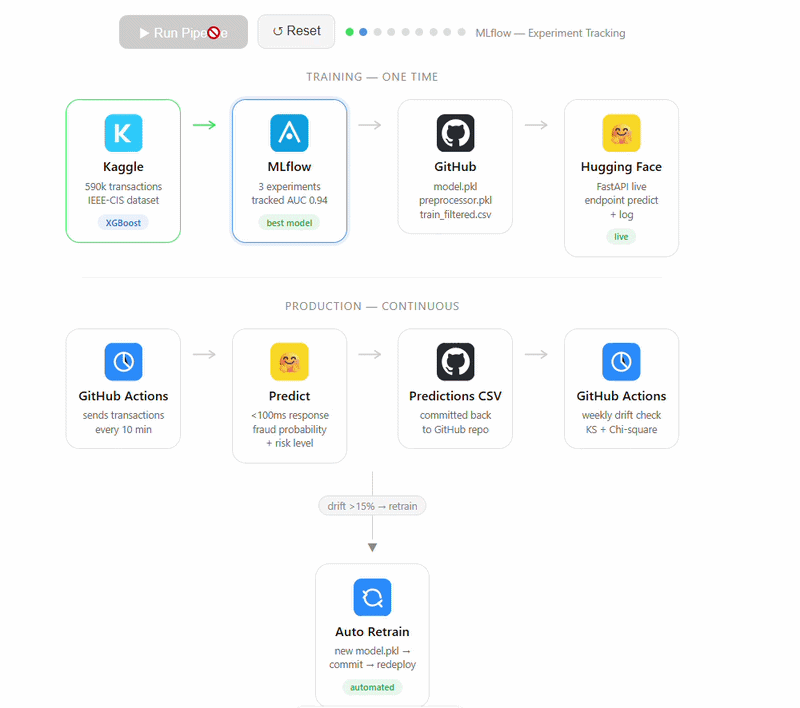

# Fraud Detection MLOps System



**Live API:** https://shan1322-fraud-detection-api.hf.space  
**Tech:** XGBoost · FastAPI · MLflow · Evidently · GitHub Actions · Hugging Face  
**Dataset:** IEEE-CIS Fraud Detection (590K transactions, 394 features)

---

## 🚀 Overview

Production-ready fraud detection system that:
- Detects fraud in real time (<100ms)
- Monitors model drift automatically
- Retrains itself when performance drops

---


> Optimized for **high recall (82%)** to catch maximum fraud cases.

---

## ⚙️ System Flow

```
Data → Train → Deploy API → Log Predictions  
     → Drift Detection → Auto Retrain → Redeploy
```

---

## 🏗️ Key Highlights

- Handles **96.5% class imbalance** using `scale_pos_weight`
- 217 engineered features after cleaning
- SHAP-based feature importance
- No data leakage (train-only preprocessing)
- Drift detection using KS + Chi-square tests
- Automatic redeployment via CI/CD

---

## 🔁 MLOps Pipeline

- **Inference:** FastAPI (real-time predictions)
- **Monitoring:** GitHub Actions (weekly drift check)
- **Retraining:** Triggered if drift > 15%
- **Tracking:** MLflow experiment logs

---

## 🧪 Try It

```bash
curl -X POST https://shan1322-fraud-detection-api.hf.space/predict \
-H "Content-Type: application/json" \
-d '{"TransactionAmt":500,"card4":"visa","card6":"debit","P_emaildomain":"anonymous.com"}'
```

---

## 📂 Project Structure

```
apps/        FastAPI service  
monitor/     Drift detection  
retrain/     Auto retraining  
models/      Model artifacts  
.github/     CI/CD workflows  
```